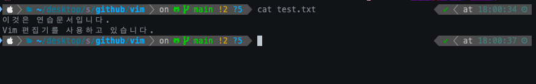

# 01-4 빔 편집기에서 텍스트 문서 만들기

## I. 빔이란
> 터미널에서 이용가능한 문서 편집기

터미널 화면에서 키보드만 으로 조작가능한 문서 편집기이다.
키보드만 사용하여 조작하므로 잘 다룬다면 시간이 단축되는 장점이 있다.

<br>

## II. 빔에서 문서 작성하고 저장

### 1. 문서 생성
> vim 명령어를 사용하면 일치하는 텍스트 파일을 찾고 열지만 없으면 새로운 텍스트 문서를 생성함
```
vim fileName
```


<br>

### 2. 빔 모드

#### 1) ex 모드
> 문서 저장, 종료를 할 수 있는 모드

문서를 열시 ex모드로 열림

입력모드에서 `ESC`를 눌러 ex모드로 올 수 있음

<br>

#### 2) 입력 모드
> 텍스트 입력, 수정을 할 수 있는 모드

ex모드에서 `I` 또는 `A`를 눌러 입력모드로 올 수 있음


<br>

### 3) ex 모드 명령
입력모드에서 텍스트를 입력한 후 `ESC`를 눌러 ex 모드로 간 후 :wq 명령어를 통해 문서를 저장, 종료 할 수 있다.


<br>

|명령|설명|
|--|--|
|`:w` 또는 `:write`|편집하던 문서를 저장|
|`q` 또는 `quit`|편집기 종료|
|:wq|편집하던 문서를 저장하고 종료|
|:q!|편집하던 문서를 저장하지 않고 편집기를 종료. 확장자가 .swp인 임시 파일이 생성|
|:wq 파일명|편집하던 문서를 파일명 이름으로 저장|

<br>

## III. cat 명령어

> 터미널창에서 텍스트 문서의 내용을 확인할 수 있게 하는 리눅스 명령어

```
cat fileName
```



|명령|기능|
|--|--|
|cat file|file 내용을 화면에 표시|
|cat file> Newfile|file(s)을 차례로 연결해서 새로운 파일인 Newfile 생성|
|cat file >> file2|file1의 내용을 file2의 내용 끝에 연결|


