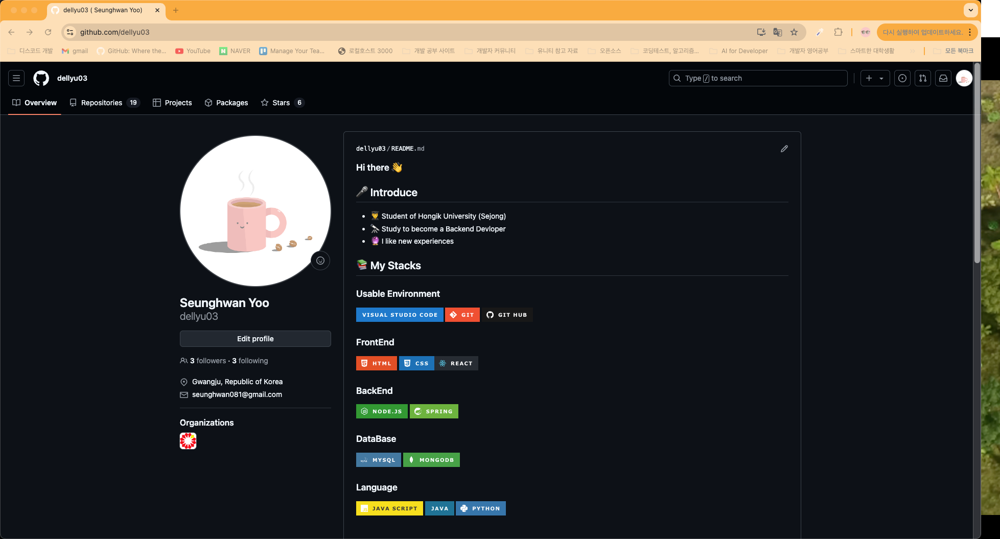
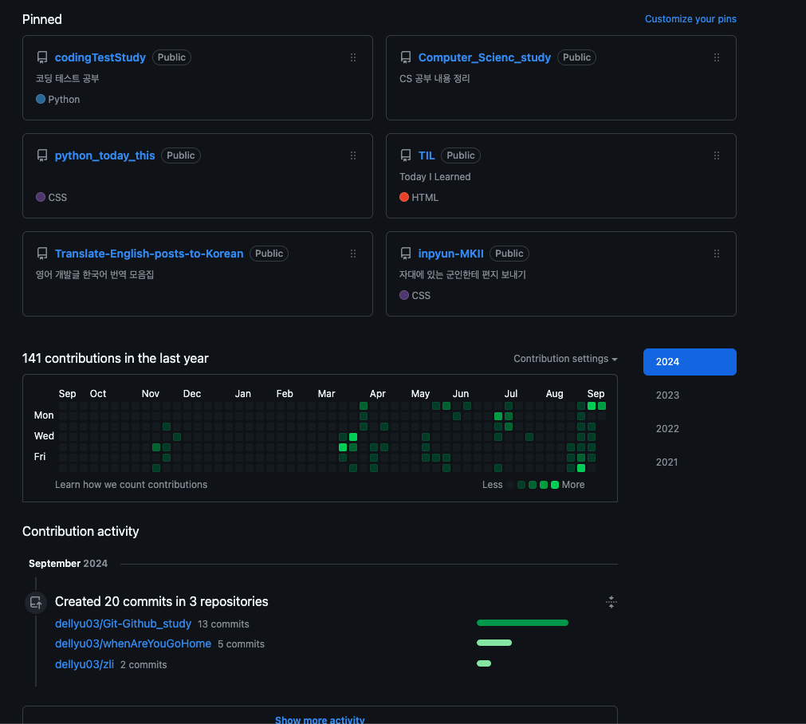

# 06-1 깃허브 프로필 관리하기

깃허브를 통해 개발이력을 드러낼 수 있다

## I. 프로필 둘러보기
> 개발 경력을 드러낼 수 있는 손쉬운 방법

협업이나 일자리 제안을 받을 수 있으므로 개발자로서의 자신의 개발 경력을 드러낼 수 있는 손쉬운 방법이기도 하다.

이름과 사진을 비롯한 개인 정보를 표시
(사용자명 저장소를 만들어서 README를 작성하면 사진처럼 프로필을 꾸밀 수 있음)

관리하는 저장소가 나타나고

깃허브의 커밋 수를 나타내주는 표가 나와있다.

 

## II. 프로필 작성하기
프로필에 `Edit`을 클릭해서 프로필을 수정해 주고 `Update profile`을 클릭하면 수정이된다.

 

## III. 컨트리뷰션 살펴보기

> 커밋을올리는것뿐 아니라 다른 오픈 소스 프로젝트에 PR을 등록하는 등의 깃허브에서 하는 모든 활동

초록색 그래프를 컨트리뷰션 그래프라고 하며 활동을 할때마다 초록색이 찍히고 하루에 컨트리뷰션이 많아질수록 색이 점점 진해진다. 

