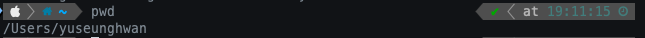
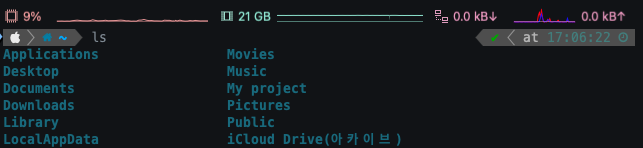
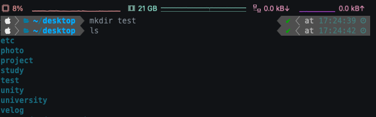
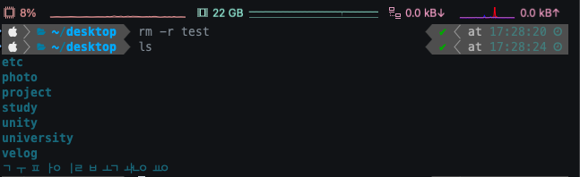

# 01-3 리눅스 명령 연습하기

## I. 현재 디렉터리 살펴보기
디렉터리 - 리눅스에서 폴더를 부르는 이름

<br></br>

### 1. 홈디렉터리


~ 표시의 모양이 지금 있는 디렉터리가 홈 디렉터리 라는 의미이다.

홈디렉터리 - 사용자 계정과 이름이 동일한 디렉터리


<br></br>

### 2. pwd
> 현재 위치의 경로가 표시됨



현재 디렉터리에 도달하기 위한 경로가 표시됨

<br></br>

### 3. ls
> 디렉터리내 파일 확인



<br></br>

#### ls 명령어 옵션
> 명령어에 특정 옵션을 추가하여 다양한 형식으로 표현 할 수 있다.

명령어 뒤에 -를 사용하여 옵션을 붙일 수 있고 -al과 같이 옵선을 2개 이상 붙여 사용할 수 있다.

```
ls -a
ls -al
```
<br></br>


|옵션|설명|
|--|--|
|-a|숨긴 파일이나 디렉터리도 함께 표시|
|-l|파일이나 디렉터리의 상세 정보를 함께 표시|
|-r|파일의 정렬 순서를 거꾸로 표시|
|-t|파일 작성 시간순으로 (내림차순)으로 표시|


<br></br>

## II. 터미널 창 지우기
> 화면이 가득 차 결과를 확인하기 어렵다면 clear 명령어를 통해 이전 명령어와 실행 결과를 지울 수 있다.

<br></br>


## III. 디렉터리 이동
> 터미널 창에서 디렉터리를 이동할 때 사용

```
cd 경로
```

<br>

### 1. 상위 디렉터리로 이동
```
cd ..
```


<br></br>

### 2. 하위 디렉터리로 이동
```
cd 하위 디렉터리 경로
```


<br>

### 3. 홈 디렉터리로 이동


<br>

## IV. 디렉터리 생성, 삭제

### 1. 디렉터리 생성
```
mkdir DirectoryName
``` 



<br>

### 2. 디렉터리 삭제
```
rm -옵션 DirectoryName
```

|옵션|설명|
|--|--|
|f|강제로 파일이나 디렉토리를 삭제하고 대상이 없는 경우에는 메시지를 출력하지 않습니다.|
|l|디렉토리 내부의 모든 내용을 삭제합니다.|
|d|비어있는 디렉토리들만 제거|
|i|매번 삭제할때마다 사용자에게 삭제할것인지 묻습니다.|
|l|3개의 이상의 파일을 삭제하거나 디렉토리 내부가 비어있지 않을때만 삭제할것인지 묻습니다.|
|v|삭제되는 대상의 정보를 출력합니다.|



<br>

## V. 터미널 종료
> 터미널 창을 닫거나 exit 명령어 입력

```
exit
```