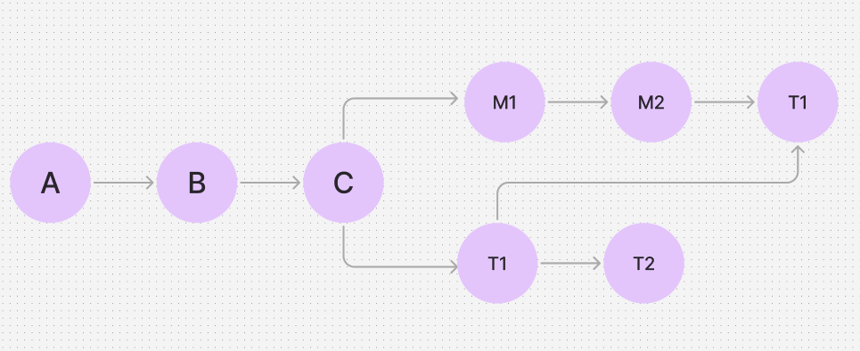

# 03-4 브랜치 병합하기

## I. 서로 다른 파일 병합하기

> 현재 브랜치 기준으로 병합 (Merge) 된다.

if 현재 메인 브랜치에 있다면

메인 브랜치를 기준으로 다른 브랜치가 병합된다.
```
git merge branchName
```

```
git merge apple
```
main 브랜치를 기준으로 apple 브랜치가 병합된다.

git log를 하게 되면

```
Merge branch apple
```
커밋이 새로 생기게 된다.

<br>

### 빨리감기 병합
> 브랜치를 분기한 후 main 브랜치에 아무런 변화가 없을때 빠르게 브랜치 병합 하는 법

브랜치 분기 후 main 브랜치에는 아무런 커밋이 없은 후 merge를 하게 된다면
Fast-forward라는 메시지가 뜨게 된다.

main 브랜치가 최신 커밋을 가르키게만 하면 되기 때문에 단순히 포인터만 움직여서 커밋 메시지 창은 열리지 않게 된다. 

<br>

## II. 서로 다른 브랜치에서 한 문서의 다른 부분을 수정했을 때 병합하기
> 서로 겹치는 부분이 없어 자연스럽게 합쳐짐

<br>

## III. 서로 다른 브랜치에서 한 문서의 같은 부분을 수정했을 때 병합하기
>  겹치는 변경사항을 수정하고 merge 해야한다.

다른 브랜치에서 같은 부분을 수정 후 merge 하면 이런식으로 충돌이 발생했다고 표시된다.

<br>


<br>

파일에 표시된 겹치는 부분을 수정한 후 커밋을 하게 되면


<br>

git graph를 보면 성공적으로 merge가 완료된걸 알 수 있다.


<br>

## IV. 병합이 끝난 브랜치 삭제하기

> 브랜치를 삭제하기

활용이 끝난 브랜치는 깃에서 삭제할 수 있다. 삭제를 한다고 기록이 사라지는 것은 아니다. 삭제를 한 후 같은 이름의 브랜치를 다시 만들게 되면 예전 내용을 다시 볼 수 있다.

아래 명령어를 사용해서 브랜치를 삭제할 수 있다.
```
git branch -d branchName
```

<br>

## V. cherry-pick으로 병합하기
> 부분적으로만 브랜치 병합

브랜치를 합칠 때 일반적으로 두 브랜치의 최신 커밋을 합치게 되면 합쳐진 새로운 버전이 만들어지게 된다.

cherry-pick은 전체 브랜치를 합치는게 하닌 특정 버전의 변경된 내용만 합치려고 할 때 사용한다.



main 브랜치와 t1 브랜치를 합치는 것이다.

아래 명령어를 사용하면 체리픽을 이용할 수 있다.
```
git cherry-pick Hash-To-cherry-Pick
```


